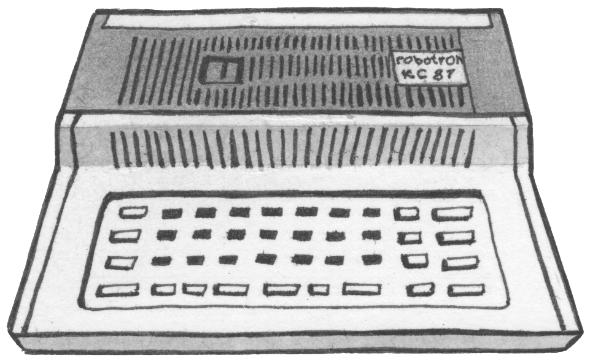

<a href="https://github.com/coignard/kc87-sdk">
  <picture>
    <source srcset="https://github.com/coignard/kc87-sdk/blob/main/assets/kc87.png?raw=true">
    
  </picture>
</a>

KC 87 SDK for flat assembler g

## License

The KC 87 SDK source code is © 2026 René Coignard and licensed under the [GNU Lesser General Public License v3.0 or later](LICENSE).

The [flat assembler g](https://github.com/coignard/fasmg) source code is © 2015-2025 Tomasz Grysztar and licensed under the [BSD 3-Clause License](https://github.com/coignard/fasmg/blob/master/core/license.txt).
